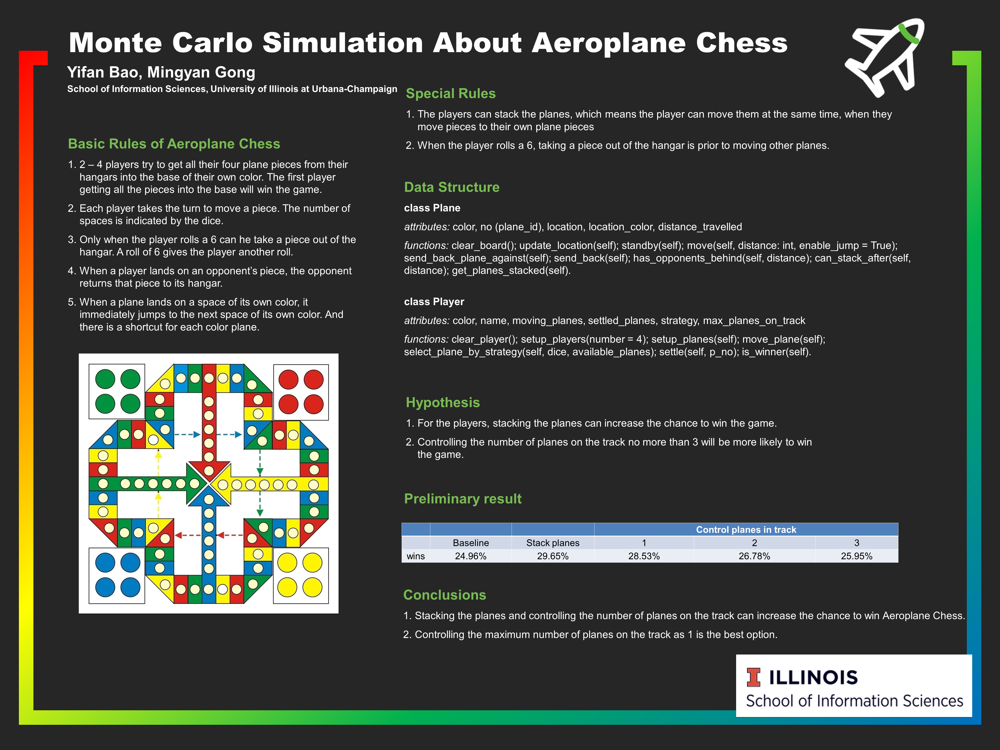

# Monte Carlo Simulation for Aeroplane Chess 

Find the strategies for Aeroplane Chess game.

## Hypothesis

1. For the players, stacking the planes can increase the chance to win the game.
2. Controlling the number of planes on the track no more than 1 will be more likely to win the game.

## Analytical summary of our findings

1. When the player chooses to stack the planes or control the number of planes on the track, the wins ratio will increase compared to the situation that the player does not choose any strategies. Therefore, we can conclude that stacking the planes and controlling the number of planes on the track can increase the chance to win Aeroplane Chess. 
2. Since the wins ratio gets the highest if the player controls the maximum number of planes as 1. Therefore, we can conclude that maximum = 1 is the best option.

## Conclusions 

1. Stacking the planes and controlling the number of planes on the track can increase the chance to win Aeroplane Chess. 
2. Controlling the maximum number of planes on the track as 1 is the best option.

## How to run the program

Run `aeroplane_chess.py` 

We simulate the game with two classes: `Plane` & `Player` and then run it for 500,000 times.

## Contributors

Yifan Bao: Designed and implemented classes & core functions and generated the output

Mingyan Gong: Implemented functions and conducted unit test

## Reference

https://en.wikipedia.org/wiki/Aeroplane_Chess
